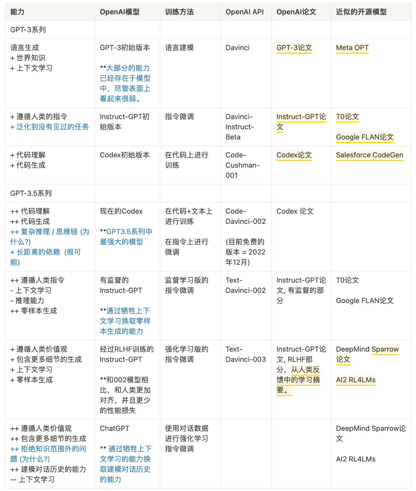

### 2020年初代GPT3

* 能力：计算能力，可以生成简单的文章
* 训练数据： 
  * 训练语料的60%来自于 2016 - 2019 的 C4 + 22% 来自于 WebText2 + 16% 来自于Books + 3%来自于Wikipedia
* 超能力来源于钞能力
  * **语言生成**的能力来自于语言建模的**训练目标** (language modeling)
  * **世界知识**来自 3000 亿单词的**训练语料库**
  * **模型的 1750 亿参数**是为了**存储知识**
* GPT-3（在 OpenAI API 中被称为`davinci`）
* 大模型：OPT  <  text-davinci-002 
* GPT3 后续
  * 代码训练
  * 指令微调 (instruction tuning) 
  * 基于人类反馈的强化学习 (reinforcement learning with human feedback, RLHF) 

### 2022版chatGPT

​	[参考](https://mp.weixin.qq.com/s/VYv8BRgGnp9ZTuXxaSuFwg)

* 发展路线[OpenAI的模型索引文档](https://platform.openai.com/docs/models/overview)

  

> * **devinci**（GPT3初代）：--->[**code-davinci-001** ，**code-cushman-001[12b]**]（Codex论文）--->  [**instruct-davinci-beta**，**text-devinci-001** ]（指令微调instructGPT论文）---> [**code-devinci-002**]（beta测试，Codex）--->[**text-davinci-002**]（SFT）---> [**text-davinci-003**，**ChatGPT**]（RLHF）
> * **Code-davinci-002**：上下文学习能力，coding能力
> * **Text-davinci-003**：加入语言建模（LM），有监督精调（SFT），零样本学习能力增强，上下文学习能力减弱
> * **chatGPT**：对话能力增强，上下文学习能力减弱
> * **指令微调**：解锁/激发原有能力，在大量数据的预训练的情况下，模型已经具备了各种能力，是通过指令微调激发出来的。
> * **在`code-davinci-002`上进行指令微调后，模型可以生成更加符合人类期待的反馈（或者说模型与人类对齐），例如：零样本问答、生成安全和公正的对话回复、拒绝超出模型它知识范围的问题。**---------> 这应该是我们所需要的。

#### `code-davinci-002`与`text-davinci-002`

  1. 相同点

     * **响应人类指令**

     * **泛化到人类未见过的任务**

     * **代码生成和代码理解**

     * 利用思维链（chain-of-thought）进行**复杂推理**：解锁突现能力和超越缩放法则（scaling laws）的关键。

     * 指令学习和代码训练

          * **指令微调**： 响应人类指令

          * **代码训练**：**可能**导致
            
            > * 模型具有思维链进行复杂推理
            >
            > * 长距离依赖

  2. 不同点

     * Code-davinci-002是基础模型

     * Text-davinci-002是code-davinci-002指令微调的结果

       > * 人工标注的指令和期待的输出
       > * 由人工标注者选择的模型输出

#### **模型（code-cushman-001 和 text-davinci-001）v.s. 002 模型（code-davinci-002 和 text-davinci-002）**

> *  001模型主要为了做纯代码/纯文本任务；002模型则深度融合了代码训练和指令微调，代码和文本都行
>* Code-davinci-002**可能是第一个深度融合了代码训练和指令微调的模型。

- **区分代码训练和指令微调效果的最好方法**可能是**比较 code-cushman-001、T5 和 FlanT5**

#### **text-davinci-002，text-davinci-003 和 ChatGPT 之间的比较**

> * 都经过指令微调
> * **text-davinci-002**是一个经过监督学习的指令微调（supervised instruction tuning）的模型
> * **text-davinci-003**和**chatGPT**是基于人类反馈的强化学习的指令微调（Instruction tuning with Reinforcement Learning from Human Feedback RLHF）

#### RLHF

> * 详实的回应
>
> * 公正的回应
>
> * 拒绝不当问题：内容过滤器+RLHF模型自身能力
>
> * 拒绝其知识范围之外的问题
>
>   
>
> - 幕后发生的事情可能是：
>
>   - ChatGPT: 通过**牺牲上下文学习**的能力**换取建模对话历史**的能力。这是一个基于经验的观测结果，因为 ChatGPT 似乎不像 text-davinci-003 那样受到上下文演示的强烈影响。
>
>   - text-davinci-003：**恢复了** text-davinci-002 所牺牲的**上下文学习能力**， **提高零样本的能力**。我们不确定这是否也是 RLHF 或其他东西的副产品。 根据instructGPT的论文，这是来自于强化学习调整阶段混入了语言建模的目标（而不是 RLHF 本身）。

|英文|中文|备注|
| :------: | :--: | ------ |
|Emergent Ability|突现能力|小模型没有，只有模型大到一定程度才会出现的能力|
|prompt|提示词|把prompt输入给大模型，大模型给出completion|
|In-Context-Learning|上下文学习|在prompt里写几个例子，模型就可以照着这些例子生成结果|
|Chain-fo-Thought|思维链|在写prompt的时候，不仅给出结果，还要一步一步地写结果是怎么推导出来的|
|Scaling Laws|缩放法则|模型的效果的线性增长 求模型的大小呈指数增长|
|Parameter-efficient Adaptation|高效参数适应|在固定住大模型参数的情况下，增加少量的新参数进行精调|
|Distribution Shift|分布转换|在一种数据分布上进行训练，在另一种数据分布上测试|
|Instruction Tuning|指令精调|用指令精调大模型|
|Code Tuning|在代码上精调|用代码精调大模型|
|RM（reward model）|奖励模型|强化学习阶段，打分模型，输出更加倾向人类想要|
|SFT （supervised fine tuning）|有监督微调|根据有监督数据，对模型参数进行微调|
|（RLHF） Reinforcement Learning with Human Feedback|基于人类反馈的强化学习|让人给模型生成的结果打分，用人打的分来调整模型|
|Alignment|对齐|让机器生成符合人类期望，人类价值观的输出|
|Alignment tax|对齐税|指令微调通过牺牲性能换取的对齐，并非故意，更可能是指令微调的副作用|

## GPT-3.5进化历程

