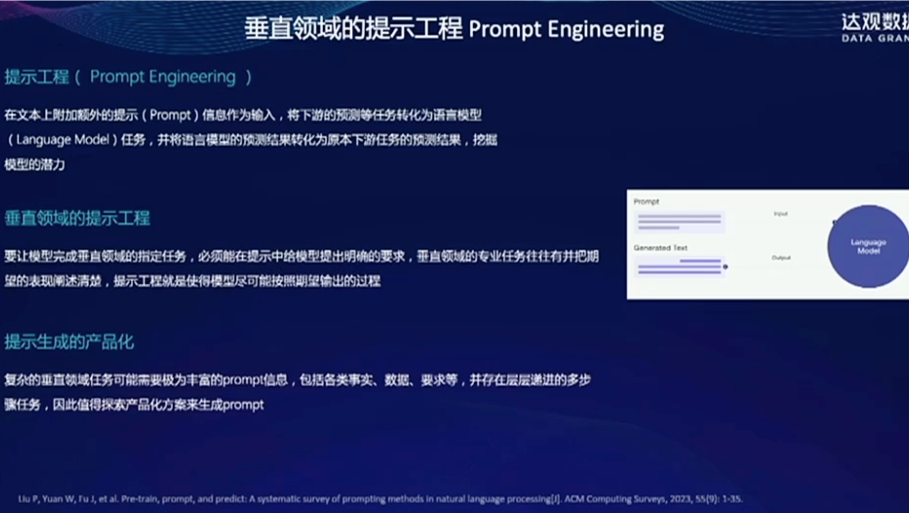
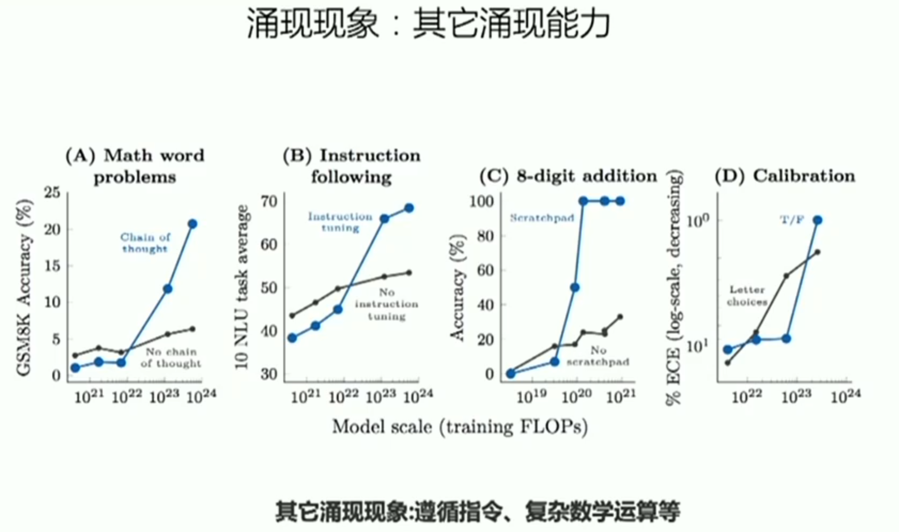

1. 思考
   1. 实践发现数据不仅仅决定模型性能，还能极大影响模型训练过程的成败，其中的原因是什么？
   2. 能力涌现是如何发生的？为什么会在百亿参数规模以上才会体现出来？或者并非涌现，知识模型规模测试不够连续？
   3. 中文等语言的数据占比非常少，例如只有不到5%，而模型中的中文表现却非常好？能力越迁是如何发生的？
   4. 大模型的能力（例如智能涌现）能否蒸馏小模型？
   5. 作为黑盒的通用大模型似乎与人脑有相似之处，未来是否可以采用脑科学研究范式研究大模型？

### 评价（万小军）

1. 作用

   1. 评价模型/系统好坏
   2. 作为调参目标
   3. 作为模型优化目标

2. 基本要求

   1. 可重复性（机器>人工）

      1. 客观反映文本质量
      1. 公正比对不同模型/系统

   2. 公平性（Reproducibility）（机器<人工）
      1. 相同设置下（硬件、软件、人员、环境等）的多次评价具有一致结果

      2. 不同设置下的评价具有一致结果

   3. 低代价（机器>人工）
      1. 评价成本低、效率高

3. NLG评价主要方法

   

* 人工比较

  

4. 问题

   问题一：参考答案有问题

   问题二：模型偏见

   

​		问题三：

问题四：

5. 人工评价问题

   问题一：

   

​		问题二：

问题二：

问题三：

6. 基于chatGPT的NLG自动评价

### 探索大预言模型的垂直化适用预训练

1. 参数规模和数据规模的探索

   

   

   

   

数据过滤和提纯方法

2. 垂直领域适应预训练

3. 微调技术探索

4. 提示工程和垂直优化
   

​	

5. 模型训练加速思路
   		

6. 模型功能的垂直效能增强

   

### 大模型涌现现象

1. 大型语言模型（LLM）：模型规模快速增长

   

   

​			
​			

2. 模型规模与涌现能力的关系

​		

​		

​		

