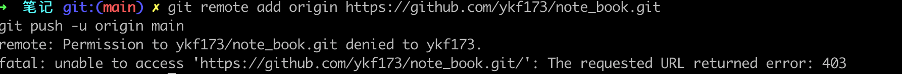

## git骚操作

[常用 Git 命令清单](https://www.ruanyifeng.com/blog/2015/12/git-cheat-sheet.html)

1. 将不是git文件的目录,添加到新的git分支
  ```bash
  git init
  git add . 将当前目录
  git branch 新分支名称
  git push 待提交目录
  提交到指定分支 
  git push --set-upstream git线上地址 分支名
  ```

2. 删除缓冲区不想提交的数据
  ```bash
  git rm -r --cached 文件 ./\*.pyc
  ```

3. 连接远程
  ```bash
  git init 
  git remote add origin ssh:/git@code.ii-ai.tech:2222/nlp/contract_review_train.git
  git remote set-url origin
  git remote update origin --prune
  ```

4. 切分支之前，删除本地无用数据
  ```bash
  git clean -d -fx
  表示：删除一些没有 git add的文件
  git clean 参数
    -n 显示将要删除的文件和目录
    -x -----删除忽略文件已经对git来说不识别的文件
    -d -----删除未被添加到git的路径中的文件
    -f -----强制运行
  
  git clean -n
  git clean -df
  git clean -f
  ```

5. 重置修改
  ```bash
  git reset. —-hard
  ```

6. 多人开发
  ```bash
  git stash
  git commit 
  git stash list
  git stash pop
  ```

7. git 日志查看

```bash 
git status
git log --graph --oneline
```

8. 提交合并(多地，多人)

```bash
git branch
git status
git log --graph --oneline
git fetch
git pull
git merge [branch]
git add [filename]
git push(如果报错，先合并，然后`git push --force`)
```

9. [git 分支比较](https://www.jianshu.com/p/bb97fabb475e)

```bash 
1. 显示出branch1和branch2中差异的部分
git diff branch1 branch2 --stat
```


* 问题1：permission denied

  

* 解决方案：

> 1. 可能是被墙了
> 2. 采用ssh方式`git remote add origin git@github.com:ykf173/note_book.git`

* 问题2:：报错：git 错误 fatal: Not a valid object name: 'master'. 
  	本地需要commit，建立连接，但是这会直接交到master ????

* 同时使用GitHub，Gitlab

  * 生成SSH-Key

    ```bash 
    在~/.ssh/目录会生成id-rsa_lab和id-rsa_lab.pub私钥和公钥。
    $ ssh-keygen -t rsa -C "邮箱" -f ~/.ssh/id_rsa_lab
    
    # 在~/.ssh/目录会生成id_rsa_hub和id_rsa_hub.pub私钥和公钥。
    $ ssh-keygen -t rsa -C "邮箱" -f ~/.ssh/id_rsa_hub
    ```

  * 修改config

    ```bash
    Host github
        Port 22
        User git
        HostName github.com
        PreferredAuthentications publickey
        IdentityFile ~/.ssh/github_id-rsa
    Host gitlab
        Port 22
        User git
        HostName gitlab.com
        PreferredAuthentications publickey
        IdentityFile ~/.ssh/gitlab_id-rsa
    ```

  * 测试

    ```bash
    ssh -T git@config配置中HostName的名称
    ```

    

* github设置本地代理

  ```bash
  # Host github.com
  #    ProxyCommand nc -X 5 -x 127.0.0.1:1080 %h %p
  ```

* mac中文乱码问题

  1. 修改配置 `git config --global core.quotepath false`
  2. 修改配置文件

  ```bash 
  1、打开oh-my-zsh配置文件 ~/.zshrc
  2、在文件最后面添加如下代码：
  export LC_ALL=en_US.UTF-8
  export LANG=en_US.UTF-8
  3、重启下终端（terminal）或输入 source ~/.zshrc
  ```

  